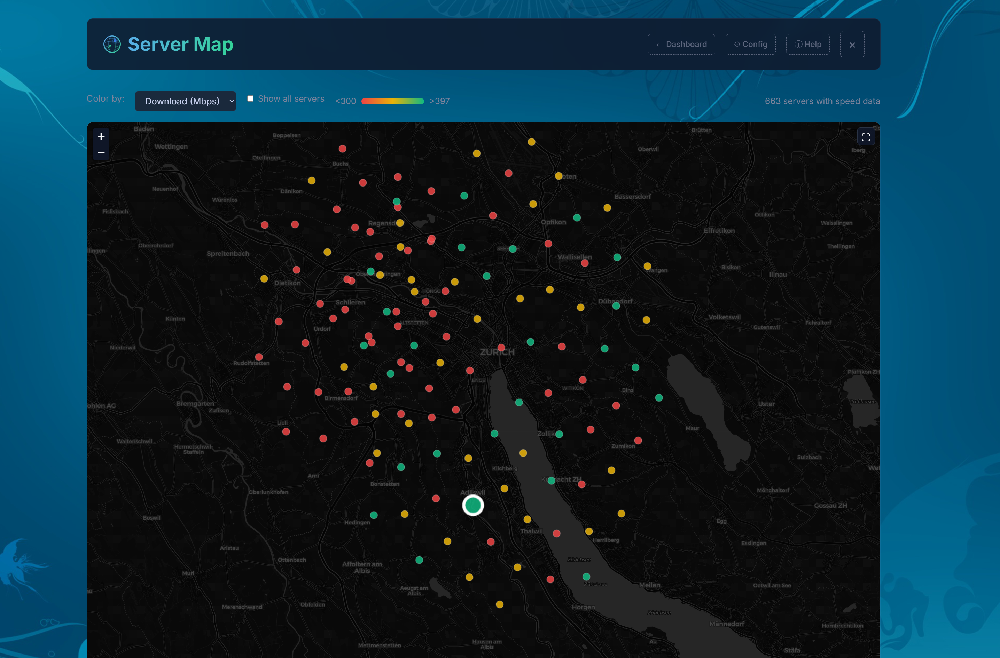
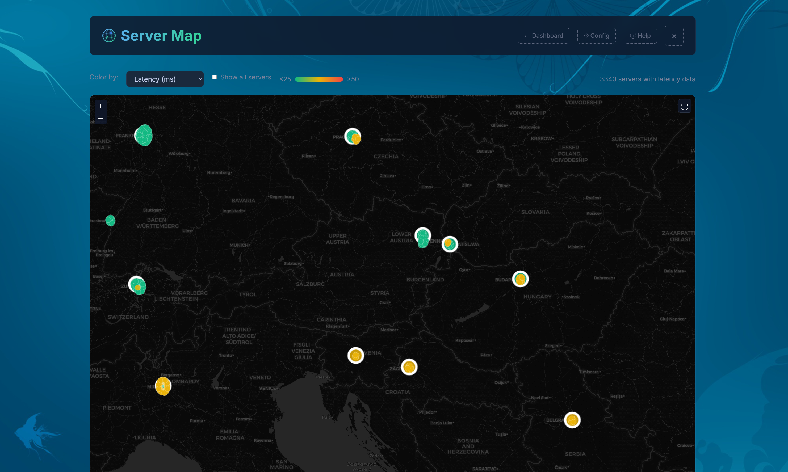
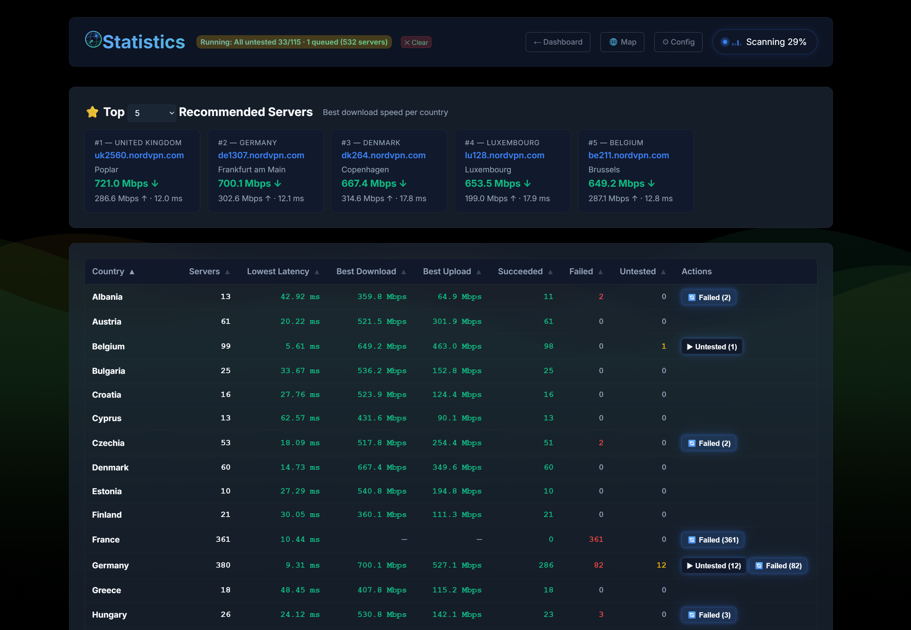
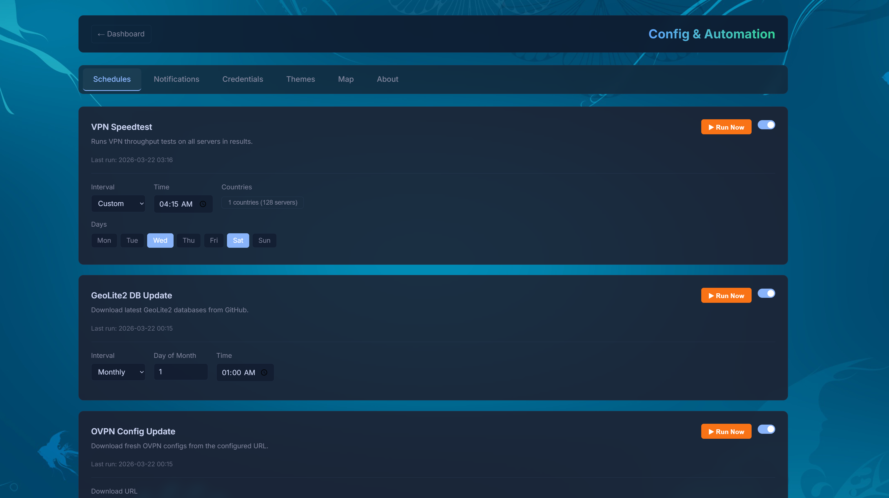

# GeoIP Performance Analyzer

**Find the fastest servers from your location — measure latency and throughput across thousands of endpoints and see the results on an interactive map.**

Network performance depends entirely on *where you are*. A server that's fast for someone in Frankfurt may be slow from Vienna. GeoIP Performance Analyzer solves this by running latency and speed tests from your deployment location against a list of domains/IPs, geolocating every result, and presenting it all in a modern web dashboard with an interactive heatmap.

Use it to find the best VPN server, the closest CDN edge, or simply understand your network topology.

<video src="assets/web-ui.mp4" autoplay loop muted playsinline width="100%"></video>

---

## Highlights

- **Interactive Server Map** — Leaflet-based heatmap with color-coded markers by latency or speed. Fastest server per country pulses. Your measurement origin is displayed so you can see what "relative to" means.
- **VPN Speedtest** — Measure real download/upload throughput through OpenVPN tunnels. Filter by country. View OVPN configs directly in the browser.
- **Statistics Dashboard** — Per-country breakdown of servers, latency, download/upload speeds, succeeded/failed/untested counts. One-click "Speedtest Untested" and "Retry Failed" buttons with a server-side queue that never drops scheduled jobs.
- **Full Automation** — Schedule scans, GeoLite DB updates, OVPN config downloads, and server list refreshes on daily/weekly/monthly/custom intervals — all from the Config UI. Scheduled speedtests queue automatically if another operation is running.
- **12 Themes & Custom Wallpapers** — Dark palettes (Dracula, Nord, Carbon, etc.) and 19 background patterns, plus custom wallpaper upload.
- **Push Notifications** — Get notified via [ntfy](https://ntfy.sh) when scans complete, updates finish, or errors occur.
- **REST API** — Full programmatic access: trigger scans, fetch results, manage config, upload data.

### Server Map

*Latency heatmap — best server per country pulses, vantage point marked:*



*Download speed — zoomed into Zurich with "Show all servers" enabled:*



### Statistics

*Per-country breakdown with one-click speedtest actions and totals:*



### Config & Automation



---

## Getting Started

### 1. Clone and start

```bash
git clone https://github.com/no2bugs/geo-ip-perf-analyzer.git
cd geo-ip-perf-analyzer
docker compose up -d
```

Open **http://localhost:5000** — the dashboard is ready.

### 2. Download GeoLite2 databases

The app needs GeoLite2 City and Country databases to resolve IP locations. You don't need to download them manually:

- Click **↻ GeoLite2 DBs** in the header bar — it downloads the latest databases automatically.
- Or schedule automatic updates in **Config → Schedules → GeoLite DB Update** (e.g., weekly).

### 3. Add servers

Click **☰ Servers List** in the header and paste your domains/IPs (one per line), then save.

To keep the list updated automatically, use **Config → Schedules → Servers List Update** — define a shell command whose output replaces the server list on a schedule (e.g., fetch from an API or scrape a provider page).

### 4. Run a scan

Click **Start Scan** on the dashboard. Progress, ETA, and live results appear in real time.

### 5. Optional: VPN Speedtest

To measure download/upload speeds through VPN:

1. Upload your OpenVPN configs via **↻ OVPN Configs** (accepts a `.zip` of `.ovpn` files), or configure an automatic download URL in **Config → Schedules → OVPN Config Update**.
2. Enter VPN credentials in **Config → Credentials**.
3. Select servers in the results table and click **Run VPN Speedtest on Selected**.

### 6. Explore the map

Click **🌐 Map** to see all results on an interactive heatmap. Switch between latency, download, and upload metrics. The fastest server in each country pulses. Your vantage point is marked so you can see how distance affects performance.

---

## Configuration

Everything is configurable from the browser at `/config`:

| Tab | What it does |
|---|---|
| **Schedules** | Automate scans, GeoLite updates, OVPN downloads, server list refresh |
| **Notifications** | ntfy push notifications for 8 event types |
| **Credentials** | VPN username/password (stored in `.env`) |
| **Themes** | 12 palettes, 19 wallpapers, custom upload |
| **Map** | Color thresholds, auto-color mode, show-all-servers toggle |
| **About** | App info and links |

---

## Docker Compose

```yaml
services:
  web:
    build: .
    ports:
      - "5000:5000"
    volumes:
      - .:/data
    environment:
      - TZ=Europe/Berlin
      - VPN_USERNAME=${VPN_USERNAME}
      - VPN_PASSWORD=${VPN_PASSWORD}
    dns:
      - 8.8.8.8
      - 1.1.1.1
    devices:
      - /dev/net/tun:/dev/net/tun
    cap_add:
      - NET_ADMIN
    restart: unless-stopped
```

Create a `.env` file for VPN credentials (or set them in Config → Credentials):

```
VPN_USERNAME=your_vpn_user
VPN_PASSWORD=your_vpn_pass
```

Rebuild after updates:

```bash
docker compose up -d --build
```
